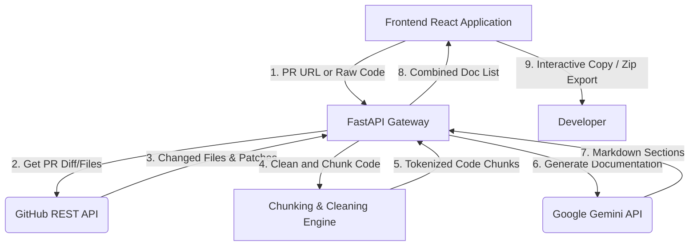

# DocDraft AI — Technical Documentation Generator

DocDraft AI is a modern, high-fidelity developer utility designed to automate the generation of structured, professional internal technical documentation from raw source code or live GitHub Pull Requests. Leveraging the Google Gemini API (`gemini-2.5-flash`) via the new `google-genai` SDK, DocDraft AI analyzes code structure, extracts key components, detects potential vulnerabilities or code smells, and produces clean, standard Markdown documentation.

---

## Table of Contents
- [Key Features](#key-features)
- [System Architecture](#system-architecture)
- [Project Directory Structure](#project-directory-structure)
- [Technology Stack](#technology-stack)
- [Setup & Installation](#setup--installation)
  - [Prerequisites](#prerequisites)
  - [Backend Configuration](#backend-configuration)
  - [Frontend Configuration](#frontend-configuration)
- [Developer Tooling & Scripts](#developer-tooling--scripts)
  - [Mock Backend Server](#mock-backend-server)
  - [CLI Demo Script](#cli-demo-script)
- [Prompt Engineering Guidelines](#prompt-engineering-guidelines)
- [License](#license)

---

## Key Features

- **Dual-Input Mode**:
  - **GitHub Pull Request**: Paste any GitHub PR URL (e.g., `https://github.com/owner/repo/pull/123`). The system fetches changed files, parses git diff patches, filters supported types, and runs batch doc generation.
  - **Direct Code Input**: Paste code snippets directly, specify the filename, select the programming language, and receive documentation instantly.
- **Smart Code-Sensitive Chunking**:
  - Diffs and raw files are processed using a token-aware boundary chunking algorithm.
  - It splits code at empty lines between top-level definitions to avoid breaking classes or functions.
  - Appends universal part headers (e.g. `# Part 1 of 3`) so the AI retains continuity.
- **Strict Architectural Output**:
  - The documentation follows a strict layout: **Overview**, **Key Components**, **Dependencies and Assumptions**, **Potential Issues**, and **Usage Example**.
  - System prompts strictly forbid conversational filler, AI apologies, or generic assertions, ensuring concise technical summaries.
- **Premium User Interface**:
  - Implements a stunning glassmorphic visual system with tailored HSL colors, smooth transitions, atmospheric particle layers, and scroll reveals.
  - Interactive tabs for switching between multiple documented files, single-click copy-to-clipboard, loading skeleton frameworks, and error boundary states.
  - **Bulk Export**: Pack all generated docs into a `.zip` archive on-the-fly and download.

---

## System Architecture



### Flow Breakdown:
1. **Request**: The user specifies a GitHub PR URL or enters code.
2. **Retrieval**: For PR inputs, the backend uses `GitHubService` to fetch files and patches.
3. **Filtering**: The files are filtered using an allowed extensions list (supports `.py`, `.js`, `.ts`, `.jsx`, `.tsx`, `.java`, `.go`, `.rs`, `.cpp`, `.cs`, `.rb`, `.php`, `.swift`, `.sql`, etc.).
4. **Token Control**: Code patches are cleaned (retaining only additions/modifications) and divided into token-bounded chunks (max ~4000 tokens equivalent) while honoring semantic block boundaries.
5. **LLM Synthesis**: Chunks are processed by `GeminiService` using `gemini-2.5-flash`.
6. **Response**: The backend aggregates the generated Markdown files and streams them back to the UI in a single response payload.

---

## Project Directory Structure

```text
Technical_Document_Generator/
├── backend/
│   ├── models/
│   │   └── schemas.py          # Pydantic request/response models
│   ├── routes/
│   │   └── docs.py             # FastAPI APIRoutes (PR & Code endpoints)
│   ├── services/
│   │   ├── gemini.py           # Gemini API integration wrapper with retries
│   │   └── github.py           # GitHub API fetch and content retriever
│   ├── utils/
│   │   └── chunking.py         # Code-sensitive boundary chunker and patch cleaner
│   ├── .env.example            # Backend template file for configurations
│   ├── main.py                 # FastAPI application root & middleware configurations
│   └── requirements.txt        # Python pip dependencies
├── frontend/
│   ├── src/
│   │   ├── components/
│   │   │   ├── app/            # Core App workspace components (Panels, Workspace page)
│   │   │   ├── landing/        # Fully featured Landing Page sections
│   │   │   └── shared/         # Shared utilities (Atmosphere, GlassCard, ScrollReveal)
│   │   ├── api.js              # Fetch requests mapping to backend routes
│   │   ├── App.jsx             # Main Router layout
│   │   ├── index.css           # Global custom tokens, scroll animations, glass styles
│   │   └── main.jsx            # React root mount
│   ├── package.json            # NPM scripts & dependencies
│   └── vite.config.js          # Vite configurations
├── prompts/
│   ├── system_prompt.txt       # Global instructions enforcing style rules
│   └── user_prompt.txt         # Code injection structure template
├── scripts/
│   └── demo_loader.py          # Offline/CLI script to verify backend locally
├── mock_backend.py             # HTTP server that mocks API responses for frontend testing
└── demo-output.md              # Document outputs generated by demo_loader.py
```

---

## Technology Stack

### Backend
- **Framework**: [FastAPI](https://fastapi.tiangolo.com/) (Python 3.10+)
- **LLM Client**: [google-genai](https://pypi.org/project/google-genai/) (Google GenAI SDK)
- **HTTP Client**: [HTTPX](https://www.python-httpx.org/) (Async requests)
- **Data Validation**: [Pydantic v2](https://docs.pydantic.dev/)

### Frontend
- **Framework**: [React 19](https://react.dev/) + [Vite](https://vitejs.dev/)
- **Routing**: [React Router DOM v7](https://reactrouter.com/)
- **Markdown Parser**: [react-markdown](https://github.com/remarkjs/react-markdown) + [remark-gfm](https://github.com/remarkjs/remark-gfm) (GitHub Flavored Markdown)
- **Syntax Highlighter**: [react-syntax-highlighter](https://github.com/react-syntax-highlighter/react-syntax-highlighter) (Prism style)
- **Compression**: [JSZip](https://stuk.github.io/jszip/) & [FileSaver](https://github.com/eligrey/FileSaver.js/) (Zip packaging and browser download management)

---

## Setup & Installation

### Prerequisites
Make sure you have the following installed on your machine:
- **Python 3.10+**
- **Node.js (v18+) & npm**

---

### Backend Configuration

1. **Navigate to backend folder**:
   ```bash
   cd Technical_Document_Generator/backend
   ```

2. **Create and activate a virtual environment**:
   ```bash
   python3 -m venv venv
   source venv/bin/activate  # On Windows: venv\Scripts\activate
   ```

3. **Install dependencies**:
   ```bash
   pip install -r requirements.txt
   ```

4. **Set Up Environment Variables**:
   Create a `.env` file from the example:
   ```bash
   cp .env.example .env
   ```
   Open the `.env` file and insert your API credentials:
   ```env
   GITHUB_TOKEN=your_github_personal_access_token_here
   GEMINI_API_KEY=your_google_gemini_api_key_here
   ```
   > **Note**: For retrieving changed files from private repositories, your `GITHUB_TOKEN` needs repository read privileges.

5. **Start the FastAPI backend**:
   ```bash
   fastapi dev main.py
   # Or using uvicorn:
   # uvicorn main:app --reload --port 8000
   ```
   The backend will launch at `http://localhost:8000`. You can inspect the interactive OpenAPI swagger page at `http://localhost:8000/docs`.

---

### Frontend Configuration

1. **Navigate to the frontend directory**:
   ```bash
   cd Technical_Document_Generator/frontend
   ```

2. **Install node dependencies**:
   ```bash
   npm install
   ```

3. **Start the Vite development server**:
   ```bash
   npm run dev
   ```
   Open `http://localhost:5173` in your browser to view the application.

---

## Developer Tooling & Scripts

### Mock Backend Server
If you want to test or design the React frontend without spending API tokens or setting up keys:
1. Run the local mock HTTP server at the project root:
   ```bash
   python3 mock_backend.py
   ```
2. This runs on `http://localhost:8000` and intercepts `/generate/from-code` and `/generate/from-pr`, serving predetermined template JSON responses.

### CLI Demo Script
You can check backend integrity and LLM response formatting directly from the terminal:
1. Ensure your backend server is running on port 8000 with valid environment variables.
2. Run the utility loader script:
   ```bash
   python3 scripts/demo_loader.py
   ```
3. This sends a mock FastAPI payment processing module containing obvious code smells (e.g., hardcoded values, lack of error handling, missing abstractions) to the API.
4. The generated markdown response is printed in the terminal and written locally to `demo-output.md`.

---

## Prompt Engineering Guidelines

The document structure and rules are strictly maintained via the static files in the `/prompts` folder. These files feed directly into the Gemini generation loop:

1. **`prompts/system_prompt.txt`**:
   - Explicitly instructs the AI to behave as a Senior Software Engineer.
   - Enforces present-tense and markdown syntax.
   - Forbids phrases like *"Here is the documentation"* or conversational filler.
   - Restricts headings to exactly: `## Overview`, `## Key Components`, `## Dependencies and Assumptions`, `## Potential Issues`, and `## Usage Example`.
   - Prohibits the use of the word "documentation" in headings to maintain a clean layout.
2. **`prompts/user_prompt.txt`**:
   - A template injection schema mapping `{filename}`, `{part_number}`, and `{code_content}` variables without causing bracket parsing errors.

---

## License

Distributed under the MIT License. See [LICENSE](LICENSE) (or repository tags) for more details.
